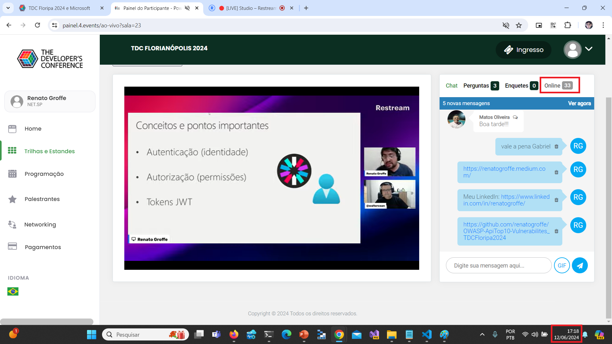
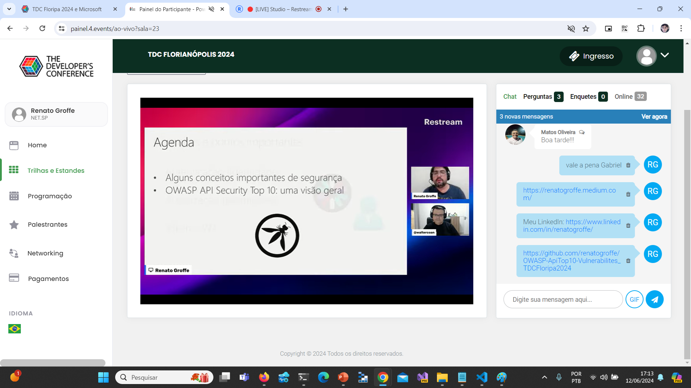
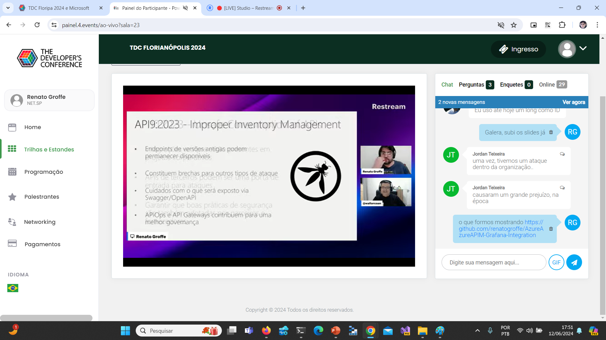
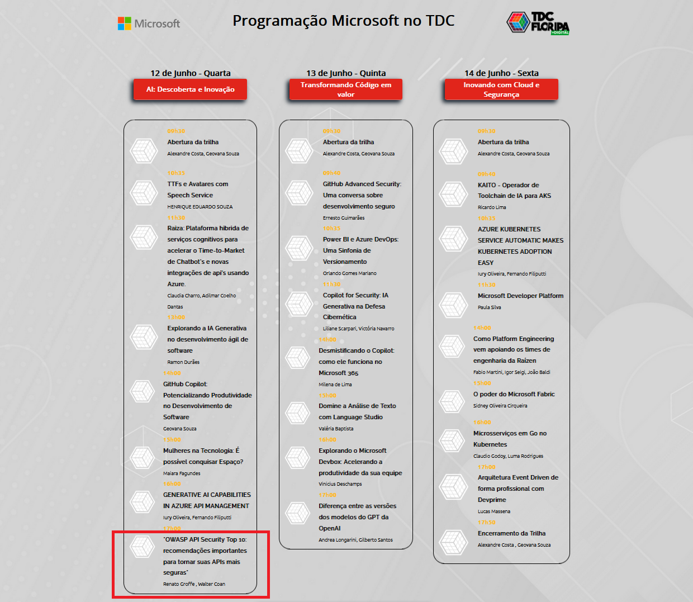

# OWASP-ApiTop10-Vulnerabilites_TDCFloripa2024
 Materiais de apresentação sobre OWASP API Security Top 10 realizada durante a edição o TDC Floripa 2024 em 12/06/2024.

---

Título da apresentação: **OWASP API Security Top 10: recomendações importantes para tornar suas APIs mais seguras**

Evento: **TDC Florianópolis 2024**

Data: **12/06/2024 (quarta-feira)**

Tipo do evento: **Online**

Ferramenta de transmissão: **Restream**

Tecnologias e tópicos abordados: **.NET, ASP.NET Core, OWASP API Security Top 10, JWT, Cybersecurity, API Gateways, Rate Limit, Resiliência, Azure API Management, Microsoft Entra ID...**

Link do evento: **https://promo.thedevconf.com/flp24-microsoft**

---

